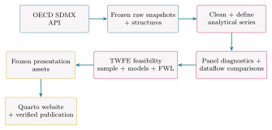

```{r}
#| label: setup
#| include: false

source(
  here::here("R", "config.R")
)
source(
  here::here("R", "examine_analytical_series.R")
)
```

## Working with Official Statistics, Reproducibly and Transparently

This project demonstrates API-based data retrieval, exploratory data analysis, and panel data econometrics in R. It also encourages researchers and students to explore OECD databases as a resource for investigating political, social, and economic questions and, more broadly, to become familiar with official statistical platforms, an increasingly important skill in the AI era [@boarini2026protecting].

The **OECD *How's Life?* Well-being Database**, part of the [OECD WISE Centre — Centre on Well-being, Inclusion, Sustainability and Equal Opportunity's](https://www.oecd.org/en/about/directorates/centre-on-well-being-inclusion-sustainability-and-equal-opportunity.html) broader work on measuring well-being and progress, brings together indicators on current well-being, well-being inequalities, and the resources that underpin future well-being [@oecd_hows_life_metadata_2026]. 

This GitHub Pages project explores the database as a statistical system rather than as a mere collection of downloadable tables.

The *Current well-being* dataset serves as the primary example throughout the project.

## Geographic Coverage {#country-coverage}

Which countries—or, in OECD terminology, **reference areas**, a broader term that includes geographic units beyond countries—are actually represented in the *Current well-being* dataset?

The interactive matrix in @fig-country-coverage maps reference-area coverage across the **analytical series**.

::: {#fig-country-coverage}
<div id="country-coverage-matrix" class="country-coverage" aria-live="polite">
  <p class="series-loading">Loading country coverage…</p>
</div>

Reference-area coverage across *Current well-being* analytical series
<span class="object-caption-subtitle">302 analytical series</span>
:::

<noscript>
This coverage explorer requires JavaScript.
</noscript>

<script src="assets/country-coverage.js" defer></script>

@fig-country-coverage can be read in either direction: which reference areas are covered by a given series, and which series are available for a given reference area.

Coverage is evaluated against each analytical series' own observed temporal support:

- A cell is *complete* when the reference area is observed in every period represented by that series.
- A cell has *partial coverage* when the reference area is observed in some, but not all, of those periods.
- A cell has *no observations* when the series contains no observation for that reference area.

:::{.data-note}
### [One database, six datasets]{.smallcaps}

While the official name is **OECD *How's Life?* Well-being Database** [@oecd_hows_life_metadata_2026], this project may also use the shorter forms "OECD *How's Life?* Database" and "OECD Well-being Database"---or simply "*How's Life?* Database" and "Well-being Database" when the OECD context is clear.

Official OECD documentation describes the database as consisting of six datasets: current well-being, current well-being vertical inequalities, current well-being by age, educational attainment, sex, and resources for future well-being [@oecd_data_explorer_hows_life_2026]. The project may therefore also use the phrase "*How's Life?* datasets".

The project retrieves all six registered *How's Life?* datasets through their corresponding SDMX dataflows, preserves raw responses and structural metadata locally, evaluates their panel structure, and compares the main *Current well-being* dataset with its age-, sex-, and education-specific counterparts.
:::

::: {.data-note}
### [A useful mental model]{.smallcaps}

Think of the OECD *How's Life?* resources as a set of related layers:

- **OECD Well-being Framework** ---The conceptual layer

11 dimensions of current well-being; inequalities examined through population-group gaps, vertical inequalities, and deprivations; and four types of resources for future well-being—economic, natural, human, and social capital [@oecd_hows_life_metadata_2026].

- **OECD _How's Life?_ Well-being Database**---The statistical layer

80+ indicators that operationalize the Well-being Framework [@oecd_hows_life_metadata_2026].

- **OECD Data Explorer**---The dissemination layer

Six related *How's Life?* datasets exposed through SDMX dataflows [@oecd_data_explorer_hows_life_2026].

- **SDMX structure and API**---The technical layer

Structures that define how the data are organized and an API that provides programmatic access to observations [@oecd_api_2025].

- **OECD Well-being Data Monitor**---The interactive layer

Tools for visualizing and exploring the *How's Life?* indicators and their underlying data [@oecd_wellbeing_monitor_2026]. 
:::

::: {.data-note}
### [Reference area]{.smallcaps}

OECD uses the SDMX concept **reference area**, or `REF_AREA`, rather than simply *country* because an observation may refer not only to an individual country but also to another geographic area or a country grouping [@oecd_hows_life_structure_2026]. 

The project therefore retains *reference area* when referring to this SDMX dimension.
:::

::: {.data-note}
### [Analytical series]{.smallcaps}

OECD uses the SDMX dimension **measure**, or `MEASURE`, to identify a substantive *How's Life?* measure [@oecd_hows_life_structure_2026; @oecd_hows_life_metadata_2026]; for example:

- `Gender wage gap`
- `Homicides`
- `Social Support`
- `Student science skills` 
- `Not having a say in government` 

There are `r N_measures` distinct `MEASURE` codes in the downloaded *Current well-being* data used by this project.

For panel analysis, this project defines an **analytical series** as a distinct combination of `MEASURE`, `UNIT_MEASURE`, `AGE`, `SEX`, `EDUCATION_LEV`, and `DOMAIN`, leaving `REF_AREA` and `TIME_PERIOD` free to vary; for example:

- `Social Support` --- Old
- `Student science skills` --- Female
- `Not having a say in government` --- Secondary education

This produces `r N_series` analytical series in the current project snapshot.

That said, the term *analytical series* is project-defined. Official OECD documentation does not appear to assign a single dedicated name to these particular cross-dimensional combinations.

Accordingly, both `r N_measures` and `r N_series` are quantities derived from the downloaded OECD data rather than official headline counts. They can change with the dataflow version, filters, or underlying data snapshot.

In the current snapshot, including `UNIT_MEASURE` and `DOMAIN` in the analytical-series definition does not change the resulting number of series.
:::

::: {.data-note}
### [Statistical series]{.smallcaps}
The project-defined **analytical series** should not be confused with an SDMX **statistical series**. 

In SDMX, a series groups observations that share the same values on the identifying dimensions except for the dimension along which the series varies—most commonly time [@sdmx_glossary_2020]. 

In this project, by contrast, an analytical series fixes: 

- `MEASURE`
- `UNIT_MEASURE`
- `AGE`
- `SEX`
- `EDUCATION_LEV`
- `DOMAIN`

While allowing both `REF_AREA` and `TIME_PERIOD` to vary. 

An analytical series therefore represents a potential reference-area–time panel rather than an individual SDMX statistical series.
:::

## What This Project Investigates

Beyond illustrating a systematic approach to data collection and analysis using the OECD API, the project aims to answer the following questions:

- How is the *How's Life?* database represented in the OECD SDMX API?
- Which project-defined analytical series form useful reference-area–time panels?
- How balanced are those panels, and where are the gaps?
- Are the demographic dataflows reproducible from the main *Current well-being* dataflow, or do they contain distinct observations?
- What does a research-ready panel extract look like in practice?
- How can panel data econometrics be applied to OECD *How's Life?* data?

::: {.context-note}
### [This website presents frozen results]{.smallcaps}

This website presents frozen results and does not provide datasets for download. In fact, one of its purposes is to emphasize the importance of retrieving data directly from official statistical platforms.

Raw OECD downloads are excluded from version control in the public [GitHub repository](https://github.com/ealvaradomena/oecd-hows-life). 

Although the repository supports reproduction of the workflow, exact reproduction of the published numerical results additionally requires access to the preserved raw responses and structural metadata used for that build.

According to official OECD documentation, the Data Monitor and its underlying Data Explorer data are updated on a rolling basis, at least quarterly [@oecd_wellbeing_monitor_2026].

The presentation build relies on local cached artifacts and presentation-layer R code rather than rerunning the analytical pipeline or contacting the OECD API.

Interactive displays likewise read from local JSON snapshots, so their browser-side summaries do not refresh the underlying source data.

A later API request may return revised data even when the dataflow version remains unchanged.

The website could certainly be programmed to update automatically, but doing so falls outside the scope of this project.
:::

## Workflow

@fig-project-workflow presents project workflow from OECD retrieval to frozen analytical results and website publication:

::: {#fig-project-workflow}


Project workflow from OECD API-based retrieval to frozen analytical results and website publication.
:::

## Computational Infrastructure

For further details on the computational infrastructure behind this website and instructions for reproducing the analysis, see the [project README](https://github.com/ealvaradomena/oecd-hows-life#recomputing-the-analysis-later).

<script src="assets/site-refinements.js" defer></script>

